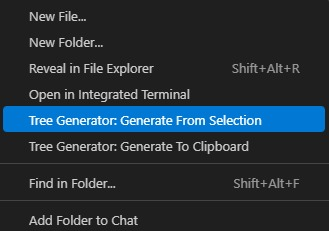
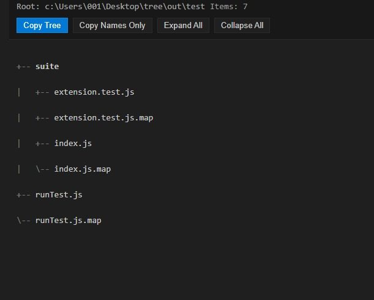
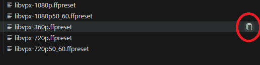

# Tree Generator Pro

A VS Code extension that generates a professional file tree from your workspace or selection.

---

## Author

* **Programmer:** Mohamad Hassoun
* **Portfolio:** https://portfoliohassoun.web.app/
* **Email:** [mohamadhassoun21698@gmail.com](mailto:mohamadhassoun21698@gmail.com)

---

## Features

* Generates a structured tree representation of files and folders.
* Supports **WebView** and **text output** modes.
* Includes **copy-to-clipboard** workflows.
* Works from **workspace root** or **selected folder**.
* Adds a custom **Explorer Tree** view in the Activity Bar.
* Lets you copy the full path of any file or folder from the custom tree.

---

## Usage

### Step 1 - Generate Tree

Right-click on a folder or open the Command Palette and run one of the commands:

* `Tree Generator: Generate From Selection`
* `Tree Generator: Generate From Workspace Root`
* `Tree Generator: Generate To Clipboard`



---

### Step 2 - View the Generated Tree

The extension will generate a structured tree view of your files and folders.

You can also:

* Copy the tree
* Copy file names only
* Expand or collapse folders



---

### Step 3 - Open Explorer Tree

Open the new **Explorer Tree** from the **Activity Bar**.

If the default VS Code Explorer is open, you can switch to it with:

* **Windows / Linux:** `Ctrl+Shift+E`
* **macOS:** `Cmd+Shift+E`

After that, click the **Explorer Tree** icon in the Activity Bar and use the custom tree view from this extension.


---

### Step 4 - Copy Path

Inside **Explorer Tree**, hover over any file or folder and click the **Copy Path** button.

This copies the full path to your clipboard.



---

## Development

### Prerequisites

* Node.js
* npm

### Setup

1. Clone the repository.
2. Run:

```bash
npm install
```

3. Build the extension:

```bash
npm run compile
```

4. Press **F5** in VS Code to launch the extension in debug mode.

If `npm` is not available globally on your machine, this workspace includes a portable Node.js runtime under:

```text
node-v20.11.1-win-x64/
```

Pressing **F5** in VS Code will use the local runtime via:

```text
.vscode/tasks.json
```

---

## Testing

Run the following command for static checks:

```bash
npm run lint
```

Currently, the project does not include an automated test suite.
